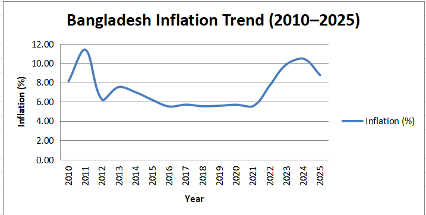
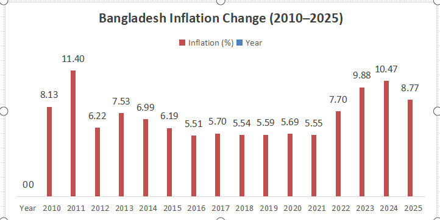

# Bangladesh Inflation Analysis

## About the Project

This project analyzes the inflation rate of Bangladesh using annual Consumer Price Index (CPI) inflation data from the World Bank.

The analysis covers the period from 2010 to 2025 and uses Microsoft Excel for data analysis and visualization.

## Objectives

- Analyze Bangladesh's inflation trend from 2010 to 2025.
- Identify the highest and lowest inflation rates.
- Calculate the average inflation rate.
- Visualize inflation trends using charts.
- Develop practical skills in Excel, data analysis, and GitHub.

## Data Source

World Bank — World Development Indicators

Indicator: Inflation, consumer prices (annual %)

## Data Period

2010–2025

## Indicator

**Inflation, consumer prices (annual %)**

This indicator measures the annual percentage change in the cost of a basket of goods and services consumed by households.

## Tools Used

- Microsoft Excel
- GitHub
- World Bank Data

## Key Findings

- Average inflation rate during 2010–2025: **7.30%**
- Highest inflation rate: **11.40% in 2011**
- Lowest inflation rate: **5.51% in 2016**
- Inflation increased significantly during 2022–2024.
- Inflation decreased from **10.47% in 2024 to 8.77% in 2025**.

## Visualizations

### Bangladesh Inflation Trend (2010–2025)

### Bangladesh Inflation Rate (2010–2025)

## Economic Interpretation

Bangladesh's inflation rate fluctuated during 2010–2025. Inflation reached its highest level in 2011 and declined during several following years. However, inflation increased significantly during 2022–2024 before declining in 2025.

The overall pattern shows that inflation varied considerably across the period rather than remaining constant.

## Limitations

- The analysis uses annual inflation data.
- Inflation is measured using the Consumer Price Index (CPI).
- Annual data may not capture short-term monthly changes in prices.
- Inflation rates alone do not provide a complete picture of overall economic performance.

## Future Scope

Future analysis could include:

- Monthly inflation analysis
- Food and non-food inflation
- GDP growth
- Interest rates
- Exchange rates
- Money supply
- Relationship between inflation and economic growth

## Conclusion

The analysis shows that Bangladesh experienced considerable variation in inflation between 2010 and 2025. The average inflation rate was 7.30%, with the highest rate recorded in 2011 and the lowest in 2016.

The analysis demonstrates how Excel and World Bank data can be used to examine economic trends and create meaningful visualizations. This project also helped develop practical skills in data analysis, Excel, and GitHub.
